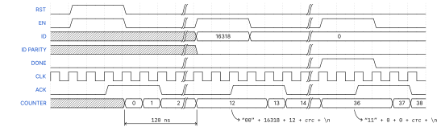

# WCET analysis of MPC deployed on Raspberry PI using RapiTime

This project contains all the tools and information to perform WCET analysis of model predictive controllers (MPCs) deployed on a Raspberry Pi. The properties of the MPC are defined using the IMPACT toolchain which is also used to generate self-contained C code. The generated code provides a library of functions to use the MPC from a C application. A small C application (i.e., `src/main.c`) iterates over a series of input states for which the optimal control problem is solved. This application is then analyzed by RapiTime with static analysis and time measurement during execution on a Raspberry Pi.


## Requirements
The project was created on a Windows machine and expects the following software to be installed.
- Python
    - Numpy
    - Numba
    - IMPACT
    - PySerial
- Make for Windows
    - Download at [Make for Windows](https://gnuwin32.sourceforge.net/packages/make.htm)
- Git for Windows
    - Download at [Git for Windows](https://gitforwindows.org/)
- ARM GNU Toolchain (arm-none-eabi)
    - Download at [Arm Developer Hub](https://developer.arm.com/downloads/-/arm-gnu-toolchain-downloads)
- FTDI Virtual COM Port drivers
    - Download at [FTDI VCP Drivers](https://ftdichip.com/drivers/vcp-drivers/)
- Rapita Verification Suite + USB License key
- Vivado ML Edition - 2022.1 (only needed to reflash the FPGA board)
    - Download at [Xilinx Downloads](https://www.xilinx.com/support/download/index.html/content/xilinx/en/downloadNav/vivado-design-tools/2022-1.html)

On the hardware side, the following equipment is required.
- Raspberry Pi 3B
- Micro SD card with a capacity of at least 4 GB
- Micro USB power supply capable of delivering 12.5 W
- USB to UART adapter for 3V3 logic levels (e.g., FTDI TTL-232R-RPi)
- 20 female-to-male jumper wires
- Arty-A7-35 FPGA development board
- Micro USB to USB cable

## Generating self-contained code for MPC
The IMPACT toolchain developed by the MECO group at KU Leuven is a toolchain for nonlinear model predictive control (NMPC) specification, prototyping, and deployment. It is built on top of CasADi and Rockit and allows NMPCs to be defined through Python scripts and YAML files. From these definitions, it is possible to generate code that can be called from C, Python, MATLAB, and Simulink. For specific solvers (e.g., qrqp) it is possible to generate fully self-contained code without any dependencies on external libraries. [^impact]
[^impact]: https://gitlab.kuleuven.be/meco-software/impact

In this project, the example of an inverted pendulum on a cart is used. The system model is defined in `model-definition.yaml` and loaded by `generate.py`. This Python script defines the properties of the controller and generates C code for it. The qrqp solver is used such that self-contained C code can be generated. The generated code is saved to `src/mpc_build_dir`. The main C file `src/main.c` loops over a number of input states defined in `src/input.h` and passes them to the MPC to be solved.

## Deploying bare-metal code on Raspberry Pi
In order to deploy bare-metal code this project uses the Raspberry Pi distribution of Alpha, a system-level GDB server to execute and debug software on Raspberry Pi over a UART connection. [^alpha]
[^alpha]: https://github.com/farjump/raspberry-pi

To start, an SD card has to be prepared to run the GDB server on the Raspberry Pi.
1. Format the SD card to the FAT32 file system.
2. Copy all the files in `alpha/boot` to the SD card.
3. Insert the SD card into the Raspberry Pi.

Next, the necessary connections have to be made.
1. Connect the USB to UART adapter between the PC and the Raspberry Pi as shown in the connection diagram.
2. Supply the Raspberry Pi with power through the micro USB port.

The C code is compiled for bare-metal execution on the Raspberry Pi using the Arm GNU Toolchain `arm-none-eabi`. The provided Makefile takes care of the compilation process and makes sure that the correct flags are set. Some specific compiler flags are needed to ensure proper execution on the Alpha GDB server. The resulting executable is saved as `main.elf`.
1. Open a Git Bash shell.
2. Ensure that the `arm-none-eabi` toolchain and Make for Windows are on the PATH variable.
3. Run `make` to compile.

The last step is to load the executable onto the Raspberry Pi and execute it. This step is scripted using the provided Makefile as well. First, a Python script `increase_baud.py` is executed that increases the baud rate of the GDB server from 115200 to 921600. This script was found on [iosoft.blog](https://iosoft.blog/2020/03/07/raspberry-pi-bare-metal-alpha/)and speeds up the upload process of the executable significantly. Next, the GDB client `arm-none-eabi-gdb` is started to run the GDB script `run.gdb`. This second script connects to the Raspberry Pi, uploads the executable, and starts the execution.

```shell
make run COM=<RPI_COM_PORT>
```
## Timestamp logger
For the timing analysis, a method of gathering timing data is required that has a minimal effect on the timing behavior of the program. RapiTime inserts instrumentation points throughout the code which use an ID to identify the location of the instrumentation point. When such an instrumentation point is encountered, the ID should be saved along with the time at which the instrumentation point was encountered.

Several methods are suggested by the RapiTime documentation of which one uses the IO pins of the platform. In this project, an FPGA development board is used to log the ID and the associated timestamp and transmit them to the PC for analysis. For each instrumentation point, a 14-bit ID is transferred to the FPGA board through the GPIO. At the same time, an enable pin is asserted to indicate that the data on the ID bus is valid. To ensure that the ID is logged, the Raspberry Pi waits for a rising edge on an acknowledge from the FPGA board. On the FPGA board is a 100 MHz 32-bit counter which is used to associate a timestamp with each ID log. The ID and timestamp are then placed in a message and transmitted to the PC over UART. Two additional lines are used by the Raspberry Pi to reset the counter or generate a message that indicates the end of the timing analysis. The figure below shows this mechanism.



Although the FPGA board has a large buffer capable of storing 16 384 logs and the UART is operating at 12 Mbaud, it is possible that the FPGA board is not able to keep up with the Raspberry Pi. To solve this issue, the acknowledge signal is held low until logs can be stored again. The Raspberry Pi will wait for the acknowledge signal and thus halt execution as well. As long as the enable signal is high, the counter will not increment. An additional measure to prevent incorrect timestamps is the ID parity bit. The odd parity line is set by the Raspberry Pi and used to check the validity of the ID bus. If not valid, the FPGA board waits for the ID bus to settle to a correct value and acknowledges when it has become valid.

The code for the timestamp logger is located in the `fpga` folder. To compile and program the Arty-A7 connect it to the PC and run the following commands in the `fpga` folder.
```shell
vivado -mode batch -source compile.tcl
vivado -mode batch -source program_spi.tcl
vivado -mode batch -source clean.tcl
```
After programming, press the `PROG` button on the board to load the configuration from the SPI flash to the FPGA.

## Connection diagram


## Analysis with RapiTime
The RVS project has been completely set up to analyze the executable we deployed on the Raspberry Pi. Except for some environment variables that specify the serial ports of the Raspberry Pi and the FPGA board, no changes should be made to the configuration to analyze the provided code.

### Setting up the license
1. Plug in the USB license key
2. Open RVS License Server Control Panel
3. Start the license server

The license is now available at `localhost:6849`.
1. Open RVS License Manager
2. Add a license server:
    - Hostname: `localhost`
    - Port: `6849`
3. Save the changes and refresh

If you get an error `File does not exist: C:\ProgramData\rapita\rvsconfig.ini`, create an empty file at this path and repeat the steps above.

### Creating a basic RapiTime project
1. Open RVS Project Manager
2. Click File → New RVS Project
3. Set the project name and target language
4. Analysis Settings
    - Analysis Tasks: `timing`
    - Default Profile: Function timing
5. Target Settings
    - Target Name: `rpi`
    - Working Folder: `<project-folder>`
    - Clean Command: `make clean`
    - Prepare Command: `make`
    - Build Command: `make`
    - Run Command: `run`
6. Integration Settings
    - Integration Strategy: Compiler Wrapper
8. Export Settings
    - Export Format: txt
    - Export File: `<project-folder>/rvs_results.txt`
9. Save Project to project folder
10. Click Actions → Deploy to generate an integration library

### Customizations for embedded analysis
*ALL THESE CUSTOMIZATIONS ARE SET UP TO WORK AS
#### Setting up the compiler wrapper
During the build process, RapiTime will execute the commands specified by the Makefile. However, to analyze the executable, calls to the compiler are intercepted by a compiler wrapper. This wrapper is able to analyze the code and insert instrumentation points.

To set up the compiler wrapper to work with the Arm GNU Toolchain the Makefile was modified such that the compiler of choice can be overridden using the command line argument  `CC`. Next, the project was configured to override the compiler with `gcc` and use the `gcc` wrapper around the Arm GNU toolchain compiler called `arm-none-eabi-gcc`.
1. Click Actions → Configure to open the project configuration
2. Project → Environment: add the path to the Arm GNU Toolchain to the path variable
3. Targets → rpi → Command Line
    - Prepare Command: `make CC=gcc`
    - Build Command: `make CC=gcc`
3. Targets → rpi → Compiler Wrapper → Add
    - Wrapper path: `gcc`
    - Original Tool Path: `arm-none-eabi-gcc`

#### Customizing the instrumentation library
Under `<project-folder>/rvs_<project-name>/rvslib-<target>-<analysis>`, RapiTime stores the instrumentation code that is inserted. The default library is written for x86 architectures and writes the processor cycle counter to a file on every instrumentation point. Three functions need to be customized in `rvs.c` to use the GPIO pins for instrumentation.
- `RVS_Init()`
  This function is called at the start of the executable and can be used to set up anything that is needed for the instrumentation. Here, this function is used to set the GPIO pins to the correct mode and to reset the counter on the timestamp logger by asserting the reset line.
- `RVS_Output()`
  The output function is called at the end of the executable. This project uses it to assert the done signal such that the timestamp logger can send a done message to the PC.
- `RVS_Ipoint(int id)`
  This is the function that is inserted at the start and end of every function to analyze the timing behavior of the executable. The function is customized to set the ID pins, assert the enable pin, and wait for a rising edge on the acknowledge pin.

Because only 14 GPIO pins are used to transfer the ID of the instrumentation points to the logger, RapiTime needs to be configured to only use 14 bits for the instrumentation point IDs. This can be set under Actions → Configure → Advanced Configuration → Analysis List → Analysis\[timing\]. There is also the location to set the frequency of the timestamp counter.
- Transmission bits: `14`
- Measurement Frequency: `100 000 000`
- Measurement Units: `microseconds`

#### Setting up the run script
To run and analyze the executable, two scripts need to run at the same time. On the one hand `make run COM=<RPI_COM_PORT>` needs to be run to upload the instrumented executable to the Raspberry Pi and execute it. On the other hand, a script needs to receive the timestamps from the logger and save them to a file. For this, the following steps were taken.
- Write a script `<project-folder>/rvs_<project-name>/scripts-<target>-<analysis>/get_trace.py`
  The Python script opens a serial port, gathers the timestamps, parses them, and stores them in a text file.
- Write a script `<project-folder>/rvs_<project-name>/scripts-<target>-<analysis>/run.js`
  The run script starts the Python script in the background and starts the execution right after. 
- Actions → Configure → Targets → rpi → Command Line
    - Run Command: `rciscript ${{scripts-folder}}run.js --project ${{project-config-path}} --integration ${{@integration-name}}`
- Actions → Configure → Project → Environment → Environment Variables
    - RPI_COM_PORT: `<RPI_COM_PORT>`
    - FPGA_COM_PORT: `<FPGA_COM_PORT>`
    - TRACE_FILE: `${{working-folder}}rvs_trace.bin`
- Actions → Configure → Integrations → rpi-timing → Data Files → Add
    - File Names: `$((TRACE_FILE))`
    - File Format: trace

The Python script to receive the timestamps saves the received bytes to a temporary file as fast as possible. If it detects the message indicating that done was asserted, the script starts to parse the received bytes. During the parse, the CRC and sequence number are checked for any errors. If an error is detected, an exception is thrown. Otherwise, the ID and timestamp are extracted and written to `rvs_trace.bin` in binary format.

#### Setting up a read filter
RapiTime includes a domain-specific language to define data conversion and filtering. For each data file, a number of converters can be specified that are all executed during the parsing stage. Here, there is a single filter file that uses the RVS read filter to read the binary file, take care of timer overflows, and deinstruments the trace. Deinstrumentation is the act of subtracting the instrumentation point overhead from the time between two points. For example, if there are 6 instrumentation points between two outer points, the overhead of one point can be subtracted 6 times from the time between these two outer points. 

For this, the minimum overhead is specified which is determined by measuring a continuous loop over instrumentation points and getting the minimum time between two points. Run these commands to find the minimum overhead.

The first command starts a script to connect to the FPGA and receive the timestamps. The results are saved to `rvs_trace.bin`.
```shell
python rvs_mpc/script-rpi-timing/get_trace.py <FPGA_COM_PORT> rvs_trace.bin
```

The second command should be executed in a separate terminal window. This command compiles and executes a test executable that loops over some instrumentation points.
```shell
make test COM=<RPI_COM_PORT>
```

When both commands have finished, the timestamps can be extracted form the file. The script calculates some statistics about the overhead and outputs them to the terminal.
```shell
python measure_overhead.py rvs_trace.bin
```

The read filter is located at `rvs_mpc/filters/parse-bin.flt`. To use it I added it to the trace file.
1. Click Actions → Configure → Integrations → rpi-timing → Data Files → 1.
2. Add a converter and set the path to the filter file.

#### Fixing the source map
During the prepare step, RapiTime analyzes the code and for this, the source code is preprocessed. The preprocessed files are stored for later use and the path of the original file for each preprocessed file is stored in an internal database. During the build step, this database is used to use the right files for compilation. Due to a bug during the prepare step, this relationship between the original files and the preprocessed files is not saved correctly in the database.

To fix this issue, a Python script `<project-folder>/rvs_<project-name>/scripts-<target>-<analysis>/fix_source_map.py` is added as a post-hook to the prepare step. To configure this the configuration was altered like this: Actions → Configure → Advanced Configuration → Integration List → Integration\[rpi-timing\]  → Scripts → Prepare Posthook: `${{scripts-folder}}fix_source_map.js`. A second JavaScript file is used to run the Python script. This allows some required variables to be accessed first and passed to the Python script as command-line arguments.

### Running the analysis
1. Connect the Raspberry Pi and FPGA board as shown in the figures above. Do not connect the FPGA board to the PC through a USB hub, as this can result in data loss.
2. Open the Windows device manager to check the serial ports of each device and set them accordingly in the project configuration.
3. Click Actions → Prepare to analyze the code.
4. Open the Analysis (Experimental) page on the bottom left.
5. In the Call Tree viewer, right-click the main function and click Add Entry Point.
3. In the Call Tree viewer, look for the function that should be analyzed, right-click it, and click Add Call Tree Root.
4. Go back to the project overview.
5. Click Actions → Build & Run to build the code with instrumentation and run it.

## Footnotes
